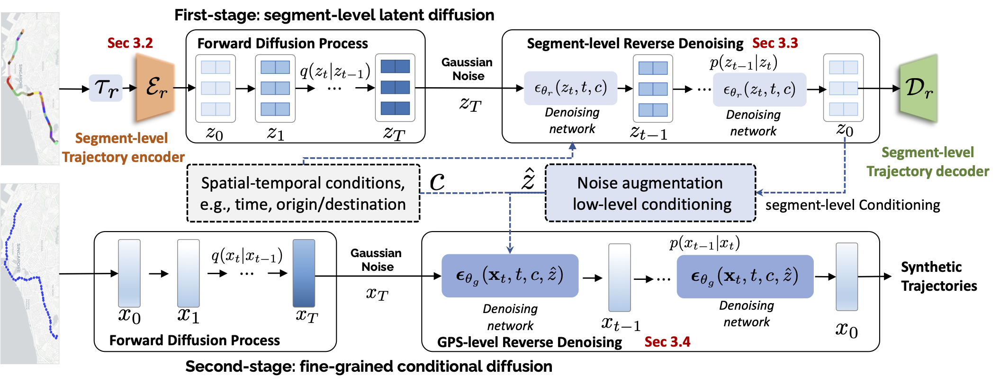

# Cardiff

This repo contains PyTorch model definitions, training, and sampling code for our paper (Has been Accepted by ACM SIGKDD 2026!) https://www.arxiv.org/abs/2507.13366:
> Leveraging the Spatial Hierarchy: Coarse-to-fine Trajectory Generation via Cascaded Hybrid Diffusion




In this paper, we propose Cardiff, a coarse-to-fine Cascaded hybrid diffusion-based framework for fine-grained and structure-plausible trajectory generation. By leveraging the hierarchical nature of urban mobility, Cardiff decomposes the generation process into two cascaded levels, i.e., discrete road segment-level and continuous fine-grained GPS-level. 

The cascaded framework consists of:

- A segment-level trajectory autoencoder to encode discrete road trajectory into latents;
- A coarse-grained segment-level latent diffusion module
- A conditional fine-grained GPS-level continuous diffusion module


## Setup

### 1. Download and set up the repo:

```
git clone https://github.com/urban-mobility-generation/Cardiff.git
cd Cardiff
```

We provide an [`environment.yml`](environment.yml) file 
that can be used to create a Conda environment. 

### 2. Prepare the dataset 
For data preprocessing steps, please [**Prepare the dataset**](https://github.com/urban-mobility-generation/Discrete-Trajectory-Autoencoder?tab=readme-ov-file#2-prepare-the-dataset).


## Sampling 

- **Pre-trained checkpoints** are stored in [`saved_models`](saved_models)

- We provided a jupyter notebook [`inference_con.ipynb`](inference_con.ipynb) for quick sampling test.

## Training Cardiff

We provide a training script for Cardiff in [`train.py`](train.py). 

- Multi-GPU Training with **Accelerate**
```
nohup accelerate launch --num_processes 3 train.py > train.log 2>&1 &
```

## BibTeX

```
@article{guo2025leveraging,
  title={Leveraging the Spatial Hierarchy: Coarse-to-fine Trajectory Generation via Cascaded Hybrid Diffusion},
  author={Guo, Baoshen and Hong, Zhiqing and Li, Junyi and Wang, Shenhao and Zhao, Jinhua},
  journal={arXiv preprint arXiv:2507.13366},
  year={2025}
}

```


Please drop me an email (baoshen@mit.edu) if you have any questions .